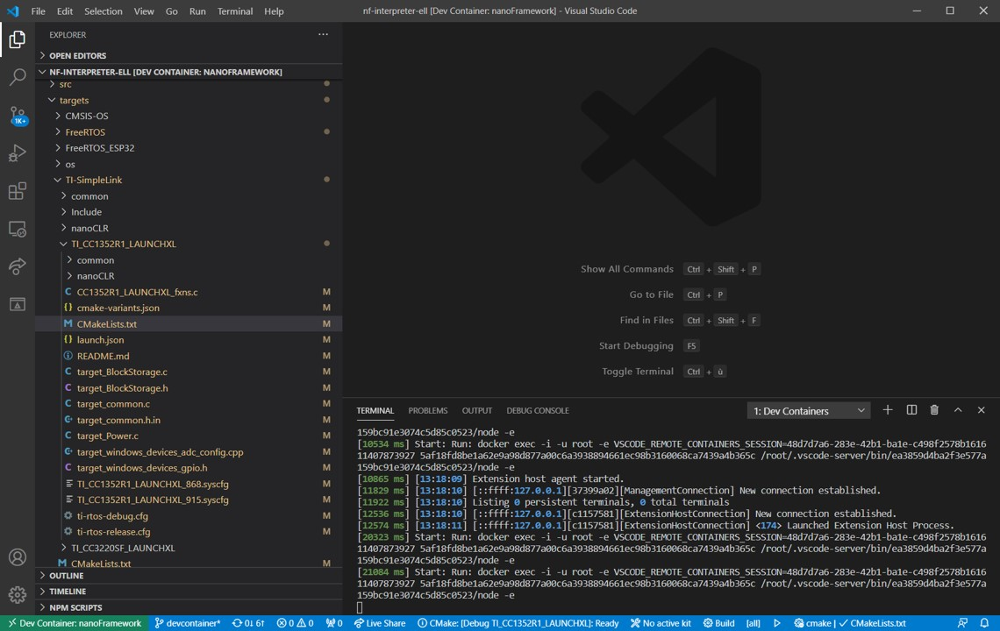
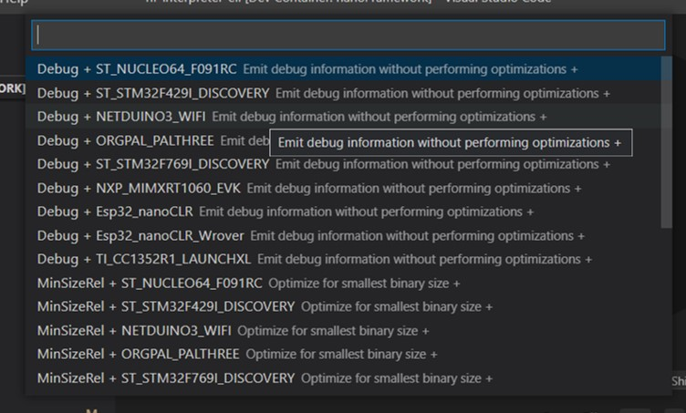
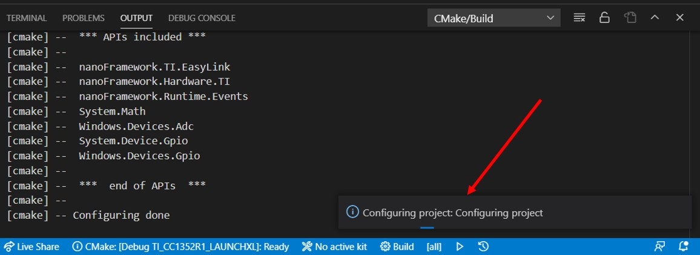

# Using Dev Container to build targets

[Dev Container](https://marketplace.visualstudio.com/items?itemName=ms-vscode-remote.remote-containers) is a way to use VS Code with a separated container. This allows to work on a separated environment than your normal Windows/Linux/Mac. This has the advantage of being isolated from the application installed, so you don't have to "pollute" your own environment with tools you may not need for other purpose. The other advantage is the ability to be pre setup, build at first request, pulling all the needed tools, repository, documents and settings that you'll need in your development.

We offer the possibility to use such a Dev Container to build any of the supported target in a very simple and straight forward way.

## Requirements

- **Step 0**: Make sure your have cloned [nf-interpreter](https://github.com/nanoframework/nf-interpreter) nanoFramework directory. The working branch is `main`.
- **Step 1**: Make sure you have [VS Code](https://code.visualstudio.com/Download) installed.
- **Step 2**: Make sure you have [Docker Desktop](https://www.docker.com/products/docker-desktop) installed.
- **Step 3**: Optional but strongly recommended for performance reasons: activate [Windows Subsystem for Linux 2](https://docs.microsoft.com/windows/wsl/install-win10) on your Windows host machine.

> note: that may require a reboot

- **Step 4**: Check Docker configuration and make sure you are signed in. In the bellow picture, the top right corner should have you Docker account. If you are not signed in, you'll get an error. And if you're using WSL2 (recommended), the checkbox for the WSL2 support should be checked.


- **Step 5**: Make sure you have the [Remote - Containers](https://marketplace.visualstudio.com/items?itemName=ms-vscode-remote.remote-containers) extension installed.
- **Step 6**: copy the file in `.\vscode\cmake-variants-DEVCONTAINER.json`to `.\vscode\cmake-variants.json`
- **Step 7**: Open the full `nf-interpreter`directory with VS Code.
- **Step 8**: Chose your container.

Go to the file `.devcontainer/devcontainer.json` and choose the container you want. You will find the details in the file itself:

```json
 // Adjust this file to chose the platform you want using the prebuild containers
 // - Dockerfile.All = you can build anything but it's a very large container
 // - Dockerfile.AzureRTOS = for AzureRTOS targets
 // - Dockerfile.ChibiOS = for ChibiOS based targets (ex: STM32, Netduino, Orgpal)
 // - Dockerfile.ESP32 = for ESP32 targets
 // - Dockerfile.TI = for TI targets
 // If you prefer, you can use the source files and adjust them they are located, with the same names in ./sources. This will alow you to customize them and add anything you may need on top.
 "dockerFile": "Dockerfile.ChibiOS",
```

> Note: as a beginner, we recommend you to use the pre built containers. If you are familiar with containers and need to adjust resources in them, then use the one which you can build yourself. Use the one in the `./sources` subdirectory. So the file name will be for example `./source/Dockerfile.All` to use the container containing everything and build it from the source.
> Error: if you get error message like "Bad CMake executable "". Is it installed or settings contain the correct path (cmake.cmakePath)?  The solution: uninstall the CMake and CMake tool from Visual Studio Code and restart Visual Studio Code.  

- **Step 9**: Once prompted, open the dev container.

  This is illustrating how to do this:

  

  > note: in our case, the dev container is called `nanoFramework`.

  If VS Code does not show the prompt, you can press F1 to show all commands. In this list, you can select the item "Remote-Containers: Open Folder in Container..." to open the dev container manually. This option will require you to select the folder through the folder selection dialog.

- **Step 10**: At that point, like in the previous illustration, when clicking on the logs, you should see activities. Be patient. Yes, super patient.
- **Step 11**: We told you to be patient, go for a tea, or a coffee. This part is resource intensive, most of your memory and processor will be used.
- **Step 12**: More patience, yes, all the needed tools and directory are cloned, all the needed settings are cloned as well. This may take a very long time if you have a low bandwidth Internet. See the advance section to understand how you can skip some of the elements if you are only interested in a very specific board.
- **Step 13**: It will be over when your VS Code will give you access to the files and will look like this:



- **Step 14**: Select the target you want to build, click on `CMake: [Unknown]: Ready`


The first time you'll do this, you will be asked to select a kit, choose the `unspecified`one:


Then you can pick the target you want to build:



- **Step 15**: This will actually prepare all what is needed in the `build`folder.

> **Important**: this may take up to 1h or more depending on the target and the performance of your machine. So be patient! While the project will be in preparation, you'll get the small window on the right:



- **Step 16**: did we already told you to be patient? :-) If you still have the little windows from the previous image, be patient! once done, go to the next step.
- **Step 17**: Hit `F7` this will trigger the build. The build will take some time as well. If all goes right, it will finish with a code 0 with something like: `[build] Build finished with exit code 0`

## Tips and tricks

### Some build may fail for size reasons

Build may fail if your image is too big. This is the case sometime when you select `debug`on some devices like the ST Nucleo one. You'll then get a build fail which looks like this:

```text
[build] Memory region         Used Size  Region Size  %age Used
[build]           flash0:       18984 B        18 KB    102.99%
[build]           flash1:          0 GB         0 GB
[build]           flash2:          0 GB         0 GB
[build]           flash3:          0 GB         0 GB
[build]           flash4:          0 GB         0 GB
[build]           flash5:          0 GB         0 GB
[build]           flash6:          0 GB         0 GB
[build]           flash7:          0 GB         0 GB
[build]           config:          0 GB         0 GB
[build]       deployment:          0 GB         0 GB
[build]            ramvt:          0 GB         0 GB
[build]             ram0:        8528 B      32720 B     26.06%
[build]             ram1:          0 GB         0 GB
[build]             ram2:          0 GB         0 GB
[build]             ram3:          0 GB         0 GB
[build]             ram4:          0 GB         0 GB
[build]             ram5:          0 GB         0 GB
[build]             ram6:          0 GB         0 GB
[build]             ram7:          0 GB         0 GB
[build]       bootclpbrd:          48 B         48 B    100.00%
[build] collect2: error: ld returned 1 exit status
```

### Making changes in your .vscode\cmake-variants.json file

Every time you make a change in the `.vscode\cmake-variants.json`file, you will have to leave the container bit clicking on the bottom left and then select `Reopen locally` and again select `Reopen in dev container`.

You usually do this operation to adjust what you want to add in your target.

More generally, any change in any of the file from the `.vscode` folder will require to exit and restart the dev container.

## Advance scenarios

A Dev Container consist of a Dockerfile and a `devcontainer.json` file. You can of course customize both and personalize your environnement. This section will give you couple of hints for this.

### Customize your devcontainer.json file

There are quite some elements you can customize, one of them is the mounting folders you want to be able to access in your container. For example, we've couple of usual folders where you can for example store your bash history or mount more folders:

```json
"mounts": [
    "source=/var/run/docker.sock,target=/var/run/docker.sock,type=bind",
    // Mount .azure folder for seamless az cli auth
    "source=${env:HOME}${env:USERPROFILE}/.azure,target=/home/vscode/.azure,type=bind",
    // Keep command history
    "source=nano-bashhistory,target=/home/vscode/commandhistory,type=volume",
]
```

You have quite a large number of elements you can customize including the extension that will be installed:

```json
// Add the IDs of extensions you want installed when the container is created.
"extensions": [
    "ms-vsliveshare.vsliveshare-pack",
    "streetsidesoftware.code-spell-checker",
    "twxs.cmake",
    "ms-vscode.cmake-tools"
]
```

### Restricting the platforms you want to download

The `Dockerfile` contains all the elements needed to build any of the target. If you have a limited bandwidth or you are only interested in a limited number of targets, you can restrict what is cloned and installed.

Everything is commented, so if for example, you are sure you'll never target any TI boards, you can comment what is related to TI. In this example, you'll comment all this:

```dockerfile
#RUN git clone --branch 4.10.00.07 https://github.com/nanoframework/SimpleLink_CC32xx_SDK.git ./sources/SimpleLinkCC32 \
    # && git clone --branch 3.61.00.16 https://github.com/nanoframework/TI_XDCTools.git ./sources/TI_XDCTools \
#    && git clone --branch 4.20.01.04 https://github.com/nanoframework/SimpleLink_CC13x2_26x2_SDK.git ./sources/SimpleLinkCC13 \
#    && git clone --branch 1.5.0 https://github.com/nanoframework/TI_SysConfig.git ./sources/TI_SysConfig
```

You will note as well that you have 2 images, one for downloading and expending the tools, the other ones where the core tools are installed and the elements downloaded from the download image are copied. You could of course optimize both images to reduce to the strict minimum you require.

This is recommended for advance users only having a minimum of understanding of the required components.

### Non root user

The default Dev Container is running with root privileges. While this is ok in a context of a simple usage where you are just using it for this task once time to time, if you start using more regularly, you may want to lower the privileges and run thru a standard user.

For this, you'll have to uncomment the last line:

```json
// Uncomment to connect as a non-root user. See https: //aka.ms/vscode-remote/containers/non-root.
,"remoteUser": "vscode"
```

in the main Dockerfile, uncomment the files and add the script `non-root-user.sh`:

```dockerfile
ARG USERNAME=vscode
ARG USER_UID=1000
ARG USER_GID=$USER_UID
```

### Flashing image

Using Docker Desktop from Windows 10 you cannot flash compiled image to your device directly
because of the limitations of serial port exposal to container.
The instructions about "Terminal" -> "Run Task" -> "Flash nanoCRL ..."  available on other
document pages here wont work.

You can flash the compiled nanoCLR.bin file with [nanoff](../getting-started-guides/getting-started-managed.md#uploading-the-firmware-to-the-board-using-nanofirmwareflasher) tool.

Example:

```console
nanoff --update --platform esp32 --serialport COM3 --clrfile nanoCLR.bin
```
