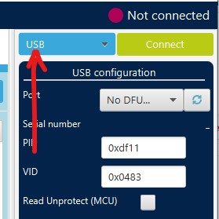
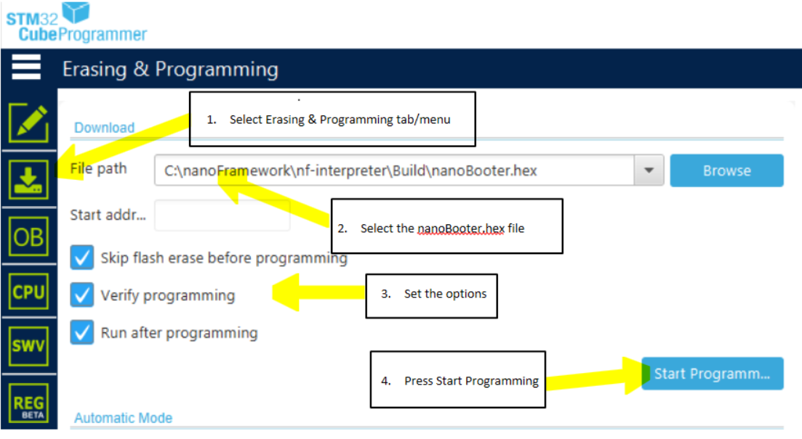

# How To Flash a target using STM32 Cube Programmer

This is a guide on how to manually flash the firmware using STM32CubeProgrammer utility.

NOTE: This utility replaces the deprecated ST-Link utility and is required as a prerquisite for boards with outdated ST-LINK firmware and certain drivers. Outdated boards will need to use this utility to update their current ST-Link firmware. Once updated, all further firmware maintentance can be carried out using the nanoFramework Firmware Flash tool [nanoff](https://github.com/nanoframework/nanoFirmwareFlasher).

## Install the STM32 Cube Programmer utility

1. Download the appropriate [STM32 Cube Programmer](https://www.st.com/en/development-tools/stm32cubeprog.html) from ST website and install it on your development machine.

## Get the .NET nanoFramework device Firmware

There are two firmware binaries to be flashed to the device, one for nanoBooter and another one for nanoCLR.

1. Download the binaries for our reference boards [here](https://github.com/nanoframework/nf-interpreter#firmware-for-reference-boards) by clicking on the appropriate badge. This will take you to our Cloudsmith repository that holds the packages with pre-build images. After downloading it, ensure to unzip the package contents to a folder of your choosing.

## Setup Connection

1. Launch the STM32 Cube Programmer that you've just installed and connect to the ST board.

### Connect to a ST-Link connected board (Discovery / Nucleo)

Note: ensure you Update the STLink Firmware before continuing using the `Firmware Upgrade` button and following the instructions.

1. Select "ST-Link" in the interface options.
    >

### Connect to a JTAG connected board

1. Connect the target board to your PC using an USB cable. Note that on most ST development boards there are TWO micro USB connectors. To follow this guide you will want to use the one that's providing the `JTAG` connection through the `ST-Link` debugger. If in doubt, check the PCB for the correct one or the board schematic.

1. Select "ST-Link" in the interface options.
    >

### Connect to a DFU connected board

1. Put your device in bootloader mode. This can be accomplished by pressing a certain combination of buttons. It depends on the particular hardware that you are using.

1. Select "USB" in the interface options.
    >

## Flash .NET nanoFramework Firmware

1. Navigate to the "Erasing and Programming" view.
    >

1. Perform a "full chip erase" to clear the flash.
    >

NOTE: If `.dfu` files were previously used for flashing, they are no longer supported using the STM32 Cube Programmer utility. `.hex` files can be used instead as outlined below.

1. Load the `nanoBooter.hex` file from the package by clicking the "Browse" button. Make sure you tick the "Run after programming" and "Skip flash erase before programming" check boxes and hit "Start Program..." button. After the upload completes, the MCU is reset and the nanoBooter image runs. You can check the success of the operation watching for a slow blink pattern on the LED. Congratulations, you now have a board running nanoFramework's booter!
    >

1. Next, load the `nanoCLR.hex` file from the extracted package folder by clicking the "Browse" button. Make sure you tick the "Run after programming" and "Skip flash erase before programming" check boxes and hit "Start Program..." button. After the upload completes, the MCU is reset and the nanoCLR image will run. This time and if all goes as expected, there will be no LED blinking. You can check if the board is properly running .NET **nanoFramework** by looking into the Device Explorer window in VS. You may have to click the "Rescan nanoDevices" button (the magnifying glass icon).
